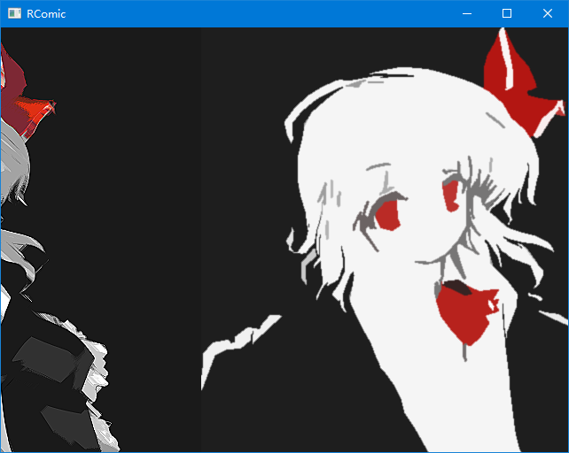

# RCOMIC

A minimal comic/image reader with right-to-left continuous scrolling.

Written with SDL2 library.

# Usage

Just drag and drop folders/images to the window to load images.

Use arrow key for moving, click to scroll automatically.

# Features

- [x] Continuous right-to-left scrolling
- [x] On-demand loading to reduce memory usage
- [x] Drag and grop files
- [x] Automatic scroll when clicking
- [x] Move with arrow key
- [ ] Adjust moving speed
- [ ] Clear loaded images
- [x] Hardware rendering
- [ ] Async image loading 
- [ ] Image scaling
- [ ] Adjust image position
- [x] Start without cmd window on Windows
- [ ] Test and run on Linux

# Screenshot

Here is the screenshot.

# Build

## Windows

I am using Visual Studio 2019 with cmake support. You could check the `CMakeSettings.json` for detail. The SDL library paths are provided in this file.
